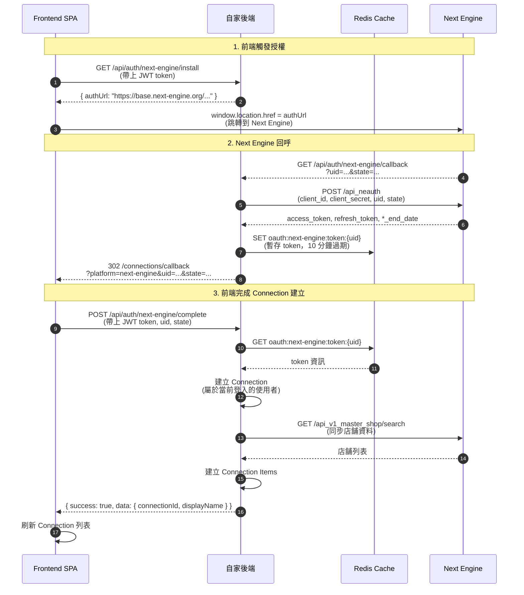

# Next Engine OAuth 流程指南（前後端分離架構）

> 📌 **重要**：本文檔說明前後端分離架構下的 Next Engine OAuth 實作方式  
> 📋 對應 Story：`docs/backlog/stories/story-5-1-next-engine-oauth.md`  
> 📚 API 參考：`docs/reference/platform-apis/NEXTENGINE_API_REFERENCE.md`

## 概述

在前後端分離架構下，OAuth callback 無法依賴 session cookie（跨域限制），因此需要採用特殊的流程設計。本文檔說明完整的實作方式與注意事項。

## 完整流程

### 1. 前端觸發授權

**前端操作：**
- 使用者點擊「前往 NE 授權」按鈕
- 前端呼叫 `GET /api/auth/next-engine/install`（需要登入）
- 後端返回 `authUrl`（Next Engine 授權 URL）
- 前端執行 `window.location.href = authUrl`，跳轉到 Next Engine

**後端實作：**
```typescript
// GET /api/auth/next-engine/install
// 需要 authMiddleware（確保使用者已登入）
// 返回：{ success: true, authUrl: "https://base.next-engine.org/users/sign_in/?client_id=...&redirect_uri=..." }
```

**重要：**
- ✅ 授權 URL **只包含** `client_id` 和 `redirect_uri`
- ❌ **不能**對 Next Engine 丟 `state` 參數（Next Engine 不支援）
- ❌ **不能**在 `redirect_uri` 中加入額外參數

### 2. Next Engine 回呼（後端處理）

**Next Engine 行為：**
- 使用者完成登入與授權後，Next Engine 會回呼我們設定的 `NEXTENGINE_REDIRECT_URI`
- 回呼參數：`uid`（授權碼）、`state`（Next Engine 自己產生的 state）

**後端處理：**
```typescript
// GET /api/auth/next-engine/callback
// 1. 接收 uid 和 state
// 2. 調用 Next Engine API 交換 token
//    POST https://api.next-engine.org/api_neauth
//    Body: client_id, client_secret, uid, state
// 3. 取得 access_token, refresh_token, *_end_date
// 4. 將 token 資訊暫存到 Redis（使用 uid 作為 key）
// 5. 重導向回前端，帶上 uid 和 state
```

**重要：**
- ✅ `state` 是 Next Engine **自己產生的**，我們只需要保存它
- ✅ Token 資訊暫存到 Redis（10 分鐘過期），使用 `uid` 作為 key
- ✅ 重導向到前端 callback 頁面：`/connections/callback?platform=next-engine&uid=...&state=...`

### 3. 前端接收處理結果

**前端處理：**
- Callback 頁面（`/connections/callback`）從 URL 取得 `uid` 和 `state`
- 前端調用 `POST /api/auth/next-engine/complete`（需要登入，帶上 JWT token）
- 後端從 Redis 取得 token，建立 Connection，返回 Connection 資訊
- 前端刷新 Connection 列表，選擇新建立的 Connection

**後端實作：**
```typescript
// POST /api/auth/next-engine/complete
// 需要 authMiddleware（識別當前登入的使用者）
// Body: { uid: string, state: string }
// 1. 從 Redis 取得 token（使用 uid 作為 key）
// 2. 驗證 state 是否匹配
// 3. 建立或更新 Connection（屬於當前登入的使用者）
// 4. 同步店舖資料（Story 5.2）
// 5. 返回 Connection 資訊
```

**重要：**
- ✅ 前端在 callback 時**已經有登入狀態**（因為是從前端跳轉過去的）
- ✅ 前端 API client 會自動帶上 `Authorization: Bearer ${token}` header
- ✅ 後端透過 `authMiddleware` 識別當前登入的使用者
- ✅ Connection 會建立到 `request.user.id`（當前登入的 admin）

### 4. Refresh Token 與錯誤處理

**Token 刷新：**
- 後端負責監控 `error.code = 002002`（token 過期）
- 使用保存的 `uid`、`state`、`refresh_token` 呼叫 `api_neauth` 刷新
- 更新 Connection 的 `authPayload`

**錯誤碼處理：**
| 錯誤碼 | 說明 | 處理方式 |
|--------|------|----------|
| `002002` | Token 過期 | 自動刷新 token |
| `002003` | Refresh token 過期 | 需要重新授權 |
| `001001` | 缺少必要參數 | 檢查參數完整性 |
| `001003` | 參數錯誤 | 檢查參數格式 |
| `002001` | 授權失敗 | 檢查 client_id/client_secret |

**重要：**
- ✅ Token、`uid`、`state` **只在後端**，前端不碰
- ✅ 所有 Next Engine API 呼叫由**後端代理**
- ✅ 前端只呼叫自己的後端 API，不直接與 Next Engine 互動

## 流程圖



## 實作重點

### ✅ 必須遵守的規則

1. **不對 Next Engine 丟 state**
   - Next Engine 授權 URL 只接受 `client_id` 和 `redirect_uri`
   - `state` 是 Next Engine 自己產生的，我們只需要保存它

2. **Token 只在後端**
   - 前端不持有 Next Engine 的 token
   - 所有 Next Engine API 呼叫由後端代理
   - 前端只呼叫自己的後端 API

3. **用戶識別方式**
   - Callback 時無法使用 session cookie（跨域限制）
   - 解決方案：前端在 callback 時主動調用完成 API（帶上 JWT token）
   - 後端透過 `authMiddleware` 識別當前登入的使用者

4. **多個 admin 可以綁同一個 NE**
   - Admin A 綁 NE A → Connection 屬於 Admin A
   - Admin B 綁 NE A → Connection 屬於 Admin B
   - 不需要額外的權限檢查，只要登入就可以綁定

### ⚠️ 常見誤解

1. **誤解：可以在 `redirect_uri` 中加入 `state` 參數**
   - ❌ 錯誤：Next Engine 不支援這種方式
   - ✅ 正確：使用 Redis 暫存 token，前端主動調用完成 API

2. **誤解：可以透過 session cookie 識別用戶**
   - ❌ 錯誤：前後端分離架構下，OAuth callback 無法跨域傳遞 cookie
   - ✅ 正確：前端在 callback 時主動調用完成 API（帶上 JWT token）

3. **誤解：需要驗證 admin 是否有權限綁定某個 NE**
   - ❌ 錯誤：目前不需要權限檢查
   - ✅ 正確：只要登入就可以綁定，Connection 屬於當前登入的 admin

## 環境變數

| 變數 | 說明 | 取得方式 |
|------|------|----------|
| `NEXTENGINE_CLIENT_ID` | Next Engine App 的 Client ID | Next Engine Developer 後台「アプリ情報」頁面 |
| `NEXTENGINE_CLIENT_SECRET` | Client Secret | 同上 |
| `NEXTENGINE_REDIRECT_URI` | 授權完成後的回呼 URL | 必須與 Next Engine 後台設定一致（例：`https://xxx.onrender.com/api/auth/next-engine/callback`） |
| `NEXTENGINE_AUTH_KEY` | 在庫連接簽章用金鑰（預共享密鑰） | 由我們系統自訂，管理員同步填入 Next Engine 後台「在庫連携設定」；OAuth 不會自動產生 |
| `REDIS_URL` | Redis 連線 URL | 用於暫存 OAuth token（必須設定） |

## 部署注意事項

### Render（後端）

1. 設定環境變數：
   - `NEXTENGINE_CLIENT_ID`
   - `NEXTENGINE_CLIENT_SECRET`
   - `NEXTENGINE_REDIRECT_URI`（必須是 Render URL）
   - `NEXTENGINE_AUTH_KEY`
   - `REDIS_URL`（⚠️ 必須設定，否則無法暫存 token）

2. 確認 `NEXTENGINE_REDIRECT_URI` 與 Next Engine Developer 後台設定一致

### Vercel（前端）

1. 設定環境變數：
   - `NEXT_PUBLIC_BACKEND_URL`（後端 API URL）

### Next Engine Developer 後台

1. 「アプリ情報」頁面：
   - 確認 `Client ID` 和 `Client Secret` 正確
   - 設定 `Redirect URI` 為後端的 callback URL

2. 「在庫連携設定」頁面：
   - 設定 `NEXTENGINE_AUTH_KEY`（與後端環境變數一致）

## 測試步驟

1. **本地測試（僅測試前端流程）：**
   ```bash
   # 啟動後端
   cd backend && npm run dev
   
   # 啟動前端
   cd frontend && npm run dev
   
   # 訪問 http://localhost:3000/connections
   # 點擊「新增 Connection」→ 選擇「Next Engine」→ 點擊「前往 NE 授權」
   # 注意：本地環境無法完成完整 OAuth 流程（需要 Next Engine 回呼到本地）
   ```

2. **正式環境測試：**
   - 確保 Render 和 Vercel 都已部署
   - 確保環境變數都已設定
   - 確保 Next Engine Developer 後台設定正確
   - 訪問前端 URL，執行完整 OAuth 流程

## 相關文件

- [Next Engine API 參考文檔](../platform-apis/NEXTENGINE_API_REFERENCE.md)
- [Next Engine 部署檢查清單](./NEXT_ENGINE_DEPLOYMENT_CHECKLIST.md)
- [Next Engine Redis 故障排除](./NEXT_ENGINE_REDIS_TROUBLESHOOTING.md)
- [Story 5.1: Next Engine OAuth](../../backlog/stories/story-5-1-next-engine-oauth.md)

## 參考實作

- 🔧 **完整實作範本**：`docs/reference/platform-apis/NE-EXAMPLE.md`（ne-test 專案完整實作範本，包含 OAuth、API、在庫連携的端到端流程）
- `ne-test/services/nextengine-client.js`：完整 OAuth + token refresh 流程
- `ne-test/server.js` 中 `/auth/ne` 與 `/auth/callback` 兩個路由：最小可執行範例
- `ne-test/docs/nextengine-integration-essentials.md`：所有已驗證 API 的摘要與注意事項

---

> **備註**：本文檔基於實際前後端分離架構的實作經驗整理，確保 OAuth 流程在跨域環境下能正常運作。

