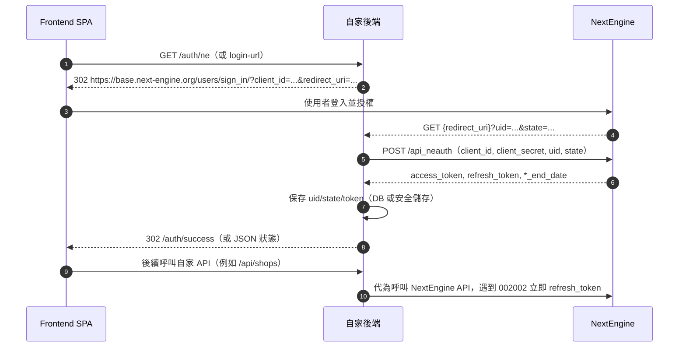

# NextEngine API Playbook（ne-test 範本）

> 使用此文件可快速在前後端分離架構下導入 NextEngine OAuth 與常用 API。流程與格式皆依 `ne-test` 實作驗證，可直接複製到其它專案調整後使用。

## 1. 環境變數與前置條件

| 變數 | 說明 | 取得方式 / 設定點 |
| --- | --- | --- |
| `NEXTENGINE_CLIENT_ID` | NextEngine App 的 Client ID | NextEngine Developer 後台 |
| `NEXTENGINE_CLIENT_SECRET` | NextEngine App 的 Client Secret | NextEngine Developer 後台 |
| `NEXTENGINE_REDIRECT_URI` | OAuth 回呼網址（需 HTTPS，可用 ngrok） | 後端路由，例如 `https://xxx.ngrok-free.app/auth/callback` |
| `NEXTENGINE_AUTH_KEY` | 在庫連接簽章用預共享密鑰 | 由我們系統產生並保存，同步填入 NextEngine 在庫連接設定 |
| `PORT` | 本地伺服器埠號 | 開發預設 3000/4000，可自行調整 |
| `NODE_ENV` | 執行環境 | `development` / `production` |

**提醒**：`NEXTENGINE_AUTH_KEY` 不會透過 OAuth 自動取得，必須在我方系統與 NextEngine 後台同時設定相同值。

## 2. OAuth 授權流程（前後端分離）



### 實作重點

- 登入 URL：`https://base.next-engine.org/users/sign_in/?client_id=<ID>&redirect_uri=<ENCODED_URI>`
- NextEngine 會自行產生 `state`，後端只需保存回傳值，後續 `api_neauth` 交換與 refresh 都使用該 `state`。
- 交換 access/refresh token：`POST https://api.next-engine.org/api_neauth`，`Content-Type: application/x-www-form-urlencoded`。
- 保存欄位：`uid`、`state`、`access_token`、`refresh_token`、`access_token_end_date`、`refresh_token_end_date`。
- Token 過期錯誤碼：`002002`。刷新時需帶 `uid/state/refresh_token`。
- 清除 token 時記得同步清除本地儲存（資料庫或快取）。

## 3. OAuth 相關 API（ne-test 路由對照）

| 路由 | 方法 | 行為 | 對應程式 |
| --- | --- | --- | --- |
| `/auth/ne` | GET | 轉導至 NextEngine 登入頁 | `server.js` |
| `/auth/callback` | GET | 處理回呼、交換 token | `NextEngineAPIService.handleCallback()` |
| `/api/token-status` | GET | 檢查 token 是否存在、是否過期 | `apiService.getTokenStatus()` |
| `/api/user-info` | GET | `/api_v1_login_user/info` | `apiService.getUserInfo()` |
| `/api/refresh-token` | POST | 手動刷新 token | `apiService.refreshToken()` |
| `/api/clear-tokens` | POST | 清除 token 與授權狀態 | `apiService.clearTokens()` |

## 4. 店舖 API

### 4.1 查詢店舖

- **路由**：`GET /api/shops`
- **NextEngine API**：`/api_v1_master_shop/search`
- **預設參數**：
  ```
  wait_flag=1
  fields=shop_id,shop_name,shop_abbreviated_name,shop_note
  ```

### 4.2 建立店舖

- **路由**：`POST /api/shops`
- **NextEngine API**：`/api_v1_master_shop/create`
- **輸入**：可選 `shopName`, `shopNote`（未提供則使用預設字串）。
- **動態產生內容**：
  - 內建 XML 模板，包含：
    - `shop_mall_id=90`（汎用商城）
    - `mall_login_id1`：預設為測試環境的在庫更新 URL
    - `mall_password1`：測試用 StoreAccount
    - `mall_login_id2`：測試用認證金鑰
- **調整建議**：部署到其它環境時請改成實際的 `UpdateStock.php` URL 與密鑰。

## 5. 商品 API

### 5.1 查詢商品

- **路由**：`GET /api/products`
- **NextEngine API**：`/api_v1_master_goods/search`
- **預設參數**：
  ```
  wait_flag=1
  fields=goods_id,goods_name,stock_quantity,supplier_name
  ```

### 5.2 建立測試商品

- **路由**：`POST /api/products`
- **NextEngine API**：`/api_v1_master_goods/upload`
- **動態產生內容**：
  - `syohin_code`、`daihyo_syohin_code`：`TEST_<timestamp>`
  - `syohin_name`：`Test Product <timestamp>`
  - 其它必填欄位使用固定測試值（`sire_code=9999`、`genka_tnk=1000`、`baika_tnk=1500`）。
  - 封裝為官方支援的 CSV 格式並以 `data_type=csv` 上傳。
- **回應**：若成功會附帶 `que_id`，可用於批次查詢。

### 5.3 批次狀態查詢

- **路由**：`GET /api/products/queue/:queId`
- **NextEngine API**：`/api_v1_system_que/search`
- **輸入**：路徑參數 `queId`。系統會帶入 `que_id-eq=<queId>` 與完整欄位。

## 6. 庫存 API

| 路由 | 方法 | NextEngine API | 主要參數 | 說明 |
| --- | --- | --- | --- | --- |
| `/api/stock` | GET | `/api_v1_master_stock/search` | 預設帶完整欄位 | 查主倉庫存 |
| `/api/stock/:productCode` | GET | 同上 | `stock_goods_id-eq=<productCode>` | 單一商品主倉 |
| `/api/warehouses` | GET | `/api_v1_warehouse_base/search` | `fields=warehouse_id,warehouse_name` | 倉庫清單 |
| `/api/stock/warehouse/:productCode` | GET | `/api_v1_warehouse_stock/search` | `warehouse_stock_goods_id-eq=<productCode>` | 預設查「基本拠点」 |
| `/api/stock` | POST | `/api_v1_warehouse_stock/upload` | 請求體：`productCode`, `newStock`, `warehouseName` | 先查現況計算差值，動態建立 CSV，加算/減算欄位擇一填寫 |
| `/api/integration-test` | POST | — | 順序呼叫 `getShops/getProducts/getStock` | 快速驗證整合 |

## 7. 在庫連接（NextEngine → 我方）

- **端點**：`GET /UpdateStock.php`
- **測試請求**：NextEngine 的「接続を確認」不帶任何參數；系統會記錄型別 `connection_test`。
- **正式請求參數**：
  - `StoreAccount`
  - `Code`（商品代表コード）
  - `Stock`
  - `ts`（時間戳）
  - `.sig`（簽章值）
- **簽章算法**：
  ```js
  const authKey = process.env.NEXTENGINE_AUTH_KEY || 'test-auth-key-12345'
  const paramString = Object.keys(params).sort().map(key => `${key}=${params[key]}`).join('&') + authKey
  const signature = md5(paramString)
  ```
- **回應**：固定 EUC-JP XML，成功回 `Processed=0`。錯誤時回 `Processed=-3`。
- **監控 API**：
  - `GET /api/inventory/updates?limit=&product_code=&store_account=`
  - `GET /api/inventory/logs?limit=&type=`
  - `DELETE /api/inventory/clear?type=stock|logs`
  - `GET /api/inventory/health`
  - `GET /api/inventory/status`

## 8. 訂單 API

### 8.1 訂單明細 rows

- **路由**：`GET /api/orders/rows`
- **NextEngine API**：`/api_v1_receiveorder_row/search`
- **預設欄位**：
  `receive_order_row_receive_order_id, receive_order_row_shop_cut_form_id, receive_order_row_no, receive_order_row_goods_id, receive_order_row_quantity, receive_order_row_cancel_flag, receive_order_row_stock_allocation_quantity, receive_order_row_stock_allocation_date, receive_order_row_creation_date, receive_order_row_last_modified_date`
- **查詢條件**：接受任意 query 參數；若 `conditions` 為空值會自動刪除避免 NE 400。

### 8.2 訂單 base

- **路由**：`GET /api/orders/base`
- **NextEngine API**：`/api_v1_receiveorder_base/search`
- **預設欄位**：`receive_order_shop_id`、`receive_order_id`、`receive_order_date`、`receive_order_total_amount` 等。

### 8.3 扣庫分析

- **路由**：`POST /api/orders/analyze-allocation`
- **Body**：`{ "goods_id": "<receive_order_row_goods_id>" }`
- **流程**：
  1. 呼叫 `/api_v1_receiveorder_row/search`，條件為 `receive_order_row_goods_id-eq=<goods_id>`、`receive_order_row_cancel_flag-eq=0`。
  2. 分析每筆 `quantity` 與 `stock_allocation_quantity`，分類為「未扣庫 / 部分扣庫 / 已扣庫 / 扣庫異常」。
  3. 回傳統計結果、總量與原始列資料。

## 9. Webhook 測試工具

- `initWebhookEventHandler(app)` 會註冊 `/api/webhook/event` 等控制端點，並提供 `GET /webhook-events` 的靜態頁面顯示即時事件。
- 搬移至其它專案時可照抄路由與前端頁面，以測試 NextEngine Webhook。

## 10. 導入建議

1. **後端**：複製 `services/nextengine-*.js` 與路由邏輯，替換成框架對應的 Controller/Router。
2. **前端**：準備按鈕或流程呼叫 `/auth/ne`，其餘 API 一律打自己後端。
3. **在庫連接**：確保 `NEXTENGINE_AUTH_KEY` 與 NextEngine 後台設定一致，測試 `接続を確認` 是否記錄。
4. **測試順序建議**：清除 token → 授權 → 取得使用者資訊 → 查店舖 → 建商品 → 查庫存 → 更新庫存 → 測試在庫回呼。

---

此文件涵蓋 `ne-test` 目前已驗證的 NextEngine OAuth 及 API 實作細節，可作為新專案的實作藍本。

